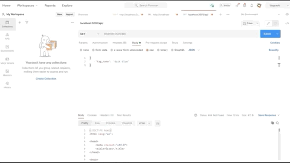

# Ecommerce Backend System

# Description
As E-commerce sales continue to sky rocket, experiencing a 40% growth in 2020, many companies are transitioning from the traditional brick and mortar stores to establish a foothold in Internet retail. This E-commerce Backend System allows business owners and managers to seamlessly grow their online business. With the help of the latest and greatest API and Database technologies, this backend web application gives businesses the competive edge in the quickly expanding online arena. 

# Installation
To install, simply clone the Github repository and add it to your local repo via your choice code-editing software (ie Visual Studio Code).

# Usage
This Web API allows online retail companies to:
* Organize important client and product information in creative Databases.
* Create, Read, Update, and Delete data, tables, columns and rows.
* Combine information from multiple tables into a single table.
* Use environment variables to securely store sensitive information, such as MySQL usernames and passwords.

## Video Turorials:
For a detailed walk-through and demonstration of the application's capabilites, please click one the following links:

* Create, Read, Update and Delete Categories:
https://drive.google.com/file/d/12gyxUM_3MwApuB2zV8VxV-UA1zQm_on-/view

* Create, Read, Update and Delete Products:
https://drive.google.com/file/d/1fQaFmi-3UVGBKB8TkyJrrBtqm6ez-Y4r/view

* Create, Read, Update and Delete Tags:
https://drive.google.com/file/d/17XXwkgCtbdZOdreH309znY4mx4FI3kyR/view

# Technology
This application was made possible with the use of the follow dev tools:
* Node.js
* Express.js
* MySQL
* Sequelize
* Dotenv
* JawsDb
